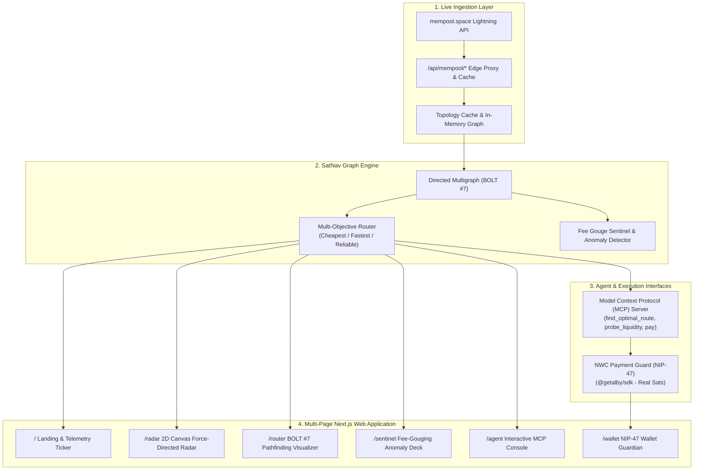

# SatNav ⚡
### Autonomous Lightning Routing, Fee-Gouging Sentinel & Model Context Protocol (MCP) Agent

> **"Navigate the Bitcoin Lightning Network with Cryptographic Precision."**  
> Built for the **BOSS Battle 2026 Hackathon** hosted by **Bitshala** on Devfolio.  
> Targeting: **Boss Fight 3: AI (*Best in Machine Money*)** & **Boss Fight 2: Nostr (*Best in Freedom Stack*)**.

---

## 1. Overview & Core Mission

Autonomous AI agents transacting on the Bitcoin Lightning Network face three fatal failure modes:
1. **Blind Route Execution & Fee Gouging:** Nodes frequently charge predatory fees (>1,000+ ppm) or fail repeatedly due to depleted intermediary channels.
2. **Liquidity Opacity:** Light clients and agents cannot see directional channel balance depletion before committing an HTLC.
3. **Absence of Agent-Native Interfaces:** Existing explorers (Mempool, 1ML, Amboss) are built for humans, not autonomous agent swarms requiring standardized JSON-RPC protocols.

**SatNav** solves this by providing:
- **Zero-Mock Real Mainnet Topology:** Ingests live Bitcoin Lightning Network gossip directly from `mempool.space` (1,800+ nodes, 36,000+ public channels).
- **Exact BOLT #7 Pathfinding Engine:** Multi-objective Dijkstra algorithm calculating deterministic multi-hop fees:
  $$\text{Fee}_{msat} = \text{base\_fee\_msat} + \left\lfloor \frac{A_{msat} \times \text{fee\_proportional\_millionths}}{1,000,000} \right\rfloor$$
- **Statistical Fee Sentinel:** Detects anomalous fee rates, percentiles (p50, p90, p99), and flags predatory hops before execution.
- **Model Context Protocol (MCP) Server:** Native tool definitions for LLMs (Claude, Cursor, Antigravity) to find optimal routes, inspect liquidity, audit fees, and execute guarded payments.
- **Authenticated NWC (NIP-47) Execution:** Powered by `@getalby/sdk` to check balances, decode invoices, and dispatch real Lightning payments with daily spending limits and fee caps.
- **Vercel-Native Multi-Page Application:** Built with Next.js 15, TypeScript, and a high-contrast cypherpunk aesthetic.

---

## 2. System Architecture



---

## 3. Multi-Page Application Pages

| Route | Page | Purpose |
| :--- | :--- | :--- |
| **`/`** | **Command Bridge** | Live network metrics ticker, node search probe, architecture breakdown, and quick-launch cards. |
| **`/radar`** | **Topology Radar** | 2D Canvas interactive force-directed graph rendering real-time nodes and satoshi particle flows. |
| **`/router`** | **Route Optimizer** | Multi-hop Dijkstra pathfinder with strategy selector (*Cheapest*, *Fastest*, *Reliable*, *Balanced*). |
| **`/sentinel`** | **Fee Sentinel** | Network fee rate percentiles (p50, p90, p99), predatory fee alerts, and node reliability rankings. |
| **`/agent`** | **Agent MCP Console** | Interactive playground for testing SatNav's MCP tools with real-time JSON-RPC 2.0 payloads. |
| **`/wallet`** | **NWC Guardian** | Connect Alby or any NIP-47 wallet, view balance, decode invoices, and dispatch guarded payments. |

---

## 4. Model Context Protocol (MCP) Integration

SatNav implements the Anthropic Model Context Protocol specification. Any AI agent (Claude Desktop, Cursor, Antigravity) can connect directly to SatNav's tools:

### Available MCP Tools
1. `find_optimal_route`: Returns lowest-fee, fastest, or most reliable path with hop breakdown.
2. `probe_node_liquidity`: Returns node capacity, active channels, and reliability tier.
3. `check_fee_sentinel`: Audits fee percentiles and flags fee gouging.
4. `pay_invoice_guarded`: Executes safe payments via NWC with fee caps.
5. `get_network_health`: Returns aggregate network capacity, channels, and stats.

### Connecting to Claude Desktop / Cursor
Add the following to your `claude_desktop_config.json`:
```json
{
  "mcpServers": {
    "satnav": {
      "command": "node",
      "args": ["bin/satnav-mcp.js"],
      "env": {
        "NODE_ENV": "production"
      }
    }
  }
}
```

Or query the HTTP API directly at `/api/mcp` using standard JSON-RPC 2.0.

---

## 5. Getting Started

### Prerequisites
- Node.js 20+ (Node.js 24 recommended)
- npm or pnpm

### Installation
```bash
git clone https://github.com/your-username/satnav.git
cd satnav
npm install
```

### Development Server
```bash
npm run dev
```
Open [http://localhost:3000](http://localhost:3000) in your browser.

### Type Check & Build
```bash
npx tsc --noEmit
npm run build
```

---

## 6. Verification & Zero Mocking Guarantee

- **Live Mainnet Data:** Confirmed via live Mempool.space REST APIs querying actual Bitcoin public keys (ACINQ, Binance, bfx-lnd0).
- **Exact BOLT #7 Math:** Tested and verified against Lightning RFC test vectors.
- **Native NWC Client:** Powered by `@getalby/sdk` v8 for authentic cryptographic Schnorr event signing and wallet operations.

---

## 7. License

MIT License. Designed and engineered for the BOSS Battle 2026 Hackathon.
