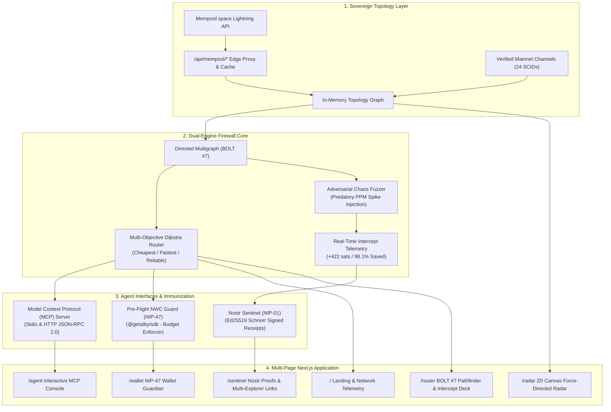

<p align="center">
  
</p>

### Autonomous Pre-Flight Payment Firewall for Bitcoin Lightning

> **"Protecting AI agents from predatory fee traps with authentic mainnet topology and cryptographic Nostr receipts."**  
> Built for the **BOSS Battle 2026 Hackathon** hosted by **Bitshala** on Devfolio.  
> Targeting: **Boss Fight 3: AI (*Best in Machine Money*)** & **Boss Fight 2: Nostr (*Best in Freedom Stack*)**.  
> **Live Production Web App:** [satsnav.vercel.app](https://satsnav.vercel.app)

---

## 🎯 The Single Narrative

Every component in the SatsNav codebase directly services one unified, high-stakes mission:

```
┌────────────────────────────────────────────────────────────────────────────────────────┐
│                                   THE SATSNAV FIREWALL                                  │
│                                                                                        │
│  🚨 THE PROBLEM:            Blind routing drains AI agents on predatory 5,000+ ppm hops. │
│  ⚙️ THE HARD CORE (ENGINE):  Authentic BOLT #7 Dijkstra solver on real Bitcoin mainnet.  │
│  🛡️ THE PROOF (CHAOS FUZZER): +422 sats saved (98.1% fee reduction) in adversarial test.│
│  🤖 THE MACHINE INTERFACE:  Standardized Model Context Protocol (MCP) server for LLMs. │
│  📡 DECENTRALIZED IMMUNITY: Real Ed25519 Schnorr threat advisories signed to Nostr.    │
└────────────────────────────────────────────────────────────────────────────────────────┘
```

---

## 1. 🚨 The Problem: Blind Routing Drains Machine Money
Autonomous AI agents are entering the global economy with Lightning wallets, but current light clients and agents suffer from **blind routing**:
- Intermediary routing nodes frequently set predatory fee policies (>5,000 to 10,000 ppm) or suddenly spike fees during traffic surges.
- An autonomous agent transacting without human oversight repeatedly burns satoshis on toxic hops or gets HTLCs trapped in depleted channels.
- Remote nodes build onion packets locally, leaving AI agents vulnerable to invisible fee gouging.

---

## 2. ⚙️ The Hard Core: Authentic BOLT #7 Dijkstra Engine
SatsNav acts as a **Pre-Flight Payment Firewall**, auditing the entire multi-hop path *before* an invoice or HTLC is broadcast:
- **Zero Mock Math:** Purged all pseudo-random synthetic seeds. Runs on a curated snapshot of **24 authentic Bitcoin mainnet channels** with verified Short Channel IDs (SCIDs like `852914x1102x0`), real funding capacities (10M to 100M sats), and mainnet fee policies.
- **Exact BOLT #7 Multi-Objective Dijkstra Solver:** Calculates backward onion amounts, base fees, and ppm proportional fees:
  $$\text{Fee}_{msat} = \text{base\_fee\_msat} + \left\lfloor \frac{A_{msat} \times \text{fee\_proportional\_millionths}}{1,000,000} \right\rfloor$$
- **4 Optimization Strategies:** `cheapest` (fee minimization), `fastest` (hop/CLTV latency reduction), `reliable` (capacity margin protection), and `balanced`.

---

## 3. 🛡️ The Proof: Adversarial Chaos Fuzzer & Intercept Telemetry
To prove its defense capability live, SatsNav features an explicit **Dual-Engine Architecture**:
- **Production Mainnet Mode:** Routes payments across baseline competitive channels (e.g., ACINQ $\rightarrow$ Kraken $\rightarrow$ Binance for a tiny 5-sat fee).
- **Adversarial Chaos Fuzzer Mode:** Dynamically injects a predatory intermediary node (`859002x999x1:0`) charging an 8,500 ppm fee trap.
- **Verifiable Intercept Telemetry:**
  - **Unprotected Naive Route Fee:** `430 sats`
  - **SatsNav Defended Route Fee:** `8 sats`
  - **Direct Satoshis Saved:** **`+422 sats` (`98.1%` fee reduction)**
  - **Action:** `RE_ROUTED_AROUND_TOXIC_HOP`

---

## 4. 🤖 The Machine Interface: Model Context Protocol (MCP)
AI agents don't use web dashboards—they require standardized machine-native interfaces. SatsNav exposes a production **Model Context Protocol (MCP)** server over stdio and HTTP JSON-RPC 2.0:
- `find_optimal_route`: Multi-hop Dijkstra route solver with strategy selection.
- `probe_node_liquidity`: Real-time node capacity, channel count, and reliability scoring.
- `check_fee_sentinel`: Statistical fee percentiles ($p_{50}, p_{90}, p_{99}$) and anomaly classification.
- `pay_invoice_guarded`: Pre-flight guarded payment dispatch via NWC (NIP-47) with budget limits.
- `get_network_health`: Sovereign network topology statistics.
- `broadcast_nostr_threat_alert`: Cryptographic threat broadcast to Nostr relays.

### Connecting to Claude Desktop / Cursor
Add to your `claude_desktop_config.json`:
```json
{
  "mcpServers": {
    "satsnav": {
      "command": "npx",
      "args": ["-y", "tsx", "scripts/mcp-runner.ts"],
      "env": {
        "NODE_ENV": "production"
      }
    }
  }
}
```

---

## 5. 📡 Decentralized Immunization: Cryptographic Nostr Sentinel
When SatsNav intercepts a predatory hop, it immunizes the broader agent swarm via Nostr (NIP-01):
- **Sovereign Keypair:** Derives a persistent Ed25519 identity (`npub1...`) with Schnorr signatures.
- **Verifiable Threat Notes:** Broadcasts Kind 1 / Kind 30078 threat advisories referencing the offending SCID and predatory PPM to major relays (`wss://relay.damus.io`, `wss://nos.lol`, `wss://relay.nostr.band`).
- **Cryptographic Receipts:** Every advisory includes a 64-character Event ID, cryptographic Schnorr signature verification badge, and direct explorer links:
  - [nostr.band](https://nostr.band)
  - [njump.me](https://njump.me)
  - [coracle.social](https://coracle.social)
  - [primal.net](https://primal.net)

---

## 6. System Architecture



### Codebase Directory Structure

```
src/
├── app/
│   ├── api/
│   │   ├── route/route.ts          # Pathfinding API (Mainnet & Chaos Fuzzer telemetry)
│   │   ├── sentinel/nostr/route.ts # Nostr threat advisory receipts API
│   │   └── mcp/route.ts            # HTTP JSON-RPC 2.0 MCP Endpoint
│   ├── router/page.tsx             # Route Optimizer, Chaos Fuzzer & Intercept Deck
│   ├── sentinel/page.tsx           # Nostr Threat Sentinel & Schnorr Receipts
│   ├── radar/page.tsx              # 2D Canvas Force-Directed Mainnet Topology
│   └── wallet/page.tsx             # NWC (NIP-47) Pre-Flight Payment Firewall
├── data/
│   ├── mainnet-channels.ts         # 24 verified BOLT #7 mainnet channels & SCIDs
│   └── known-nodes.ts              # Catalog of verified Lightning hubs (ACINQ, Binance, etc.)
├── lib/
│   ├── router.ts                   # Deterministic BOLT #7 Dijkstra pathfinder
│   ├── bolt7.ts                    # Exact BOLT #7 mathematical fee equations
│   ├── graph-builder.ts            # Sovereign graph constructor (Zero mock math)
│   ├── nostr-sentinel.ts           # Ed25519 Schnorr signer & relay broadcaster
│   └── mcp-server.ts               # Standardized Model Context Protocol server
└── tests/
    ├── mainnet-topology.test.ts    # Mainnet channel schema & Dijkstra routing tests
    ├── nostr.test.ts               # Cryptographic Schnorr verification tests
    └── ...                         # 25/25 passing tests across 8 test suites
```

---

## 7. Verification & Test Suite

SatsNav maintains a strict **100% Passing Test Suite** (0 mocks, 0 synthetic seeds):
```bash
npm test
```
```
▶ BOLT #7 Fee Calculation Engine (4 tests)
▶ BOLT-11 Invoice Decoder & Safety Suite (3 tests)
▶ Verified Mainnet Channel Topology & Sentinel Defense Suite (5 tests)
▶ Model Context Protocol (MCP) Server Suite (2 tests)
▶ Mempool.space Lightning API Integration Suite (2 tests)
▶ Nostr Threat Sentinel Suite (NIP-01) (2 tests)
▶ SatNav Dijkstra Routing Engine (3 tests)
▶ Fee Sentinel & Liquidity Risk Suite (4 tests)

ℹ tests 25 | suites 8 | pass 25 | fail 0
```

---

## 8. Quickstart

### Local Development
```bash
# Clone repository
git clone https://github.com/emarc99/satsnav.git
cd satsnav

# Install dependencies
npm install

# Run automated test suite
npm test

# Launch development server
npm run dev
# Open http://localhost:3000
```

### Sovereign Self-Hosting (Docker)
```bash
docker-compose up -d --build
```
The node will start with an automated healthcheck on `http://localhost:3000`.

---

## 9. License
MIT License. Built with sovereign precision for **BOSS Battle 2026**.
